# Kottans Front-End 2020/2021 reflections
Repository for my personal reflections, code and notes about [Front-End Course](https://github.com/kottans/frontend) (version 2020-2021) provided by [Kottans community](https://kottans.org/) :cat2:

# Stage 0

00. Git Basics

## Git Basics
- [Udacity course: Version Control with Git](#udacity-version-control-with-git)
- [Visual interactive course: Learn Git Branching (Main 1st section, Remote 1st section)](#learn-git-branching---first-sections)

### [Udacity: Version Control with Git](https://www.udacity.com/course/version-control-with-git--ud123)

Screenshots

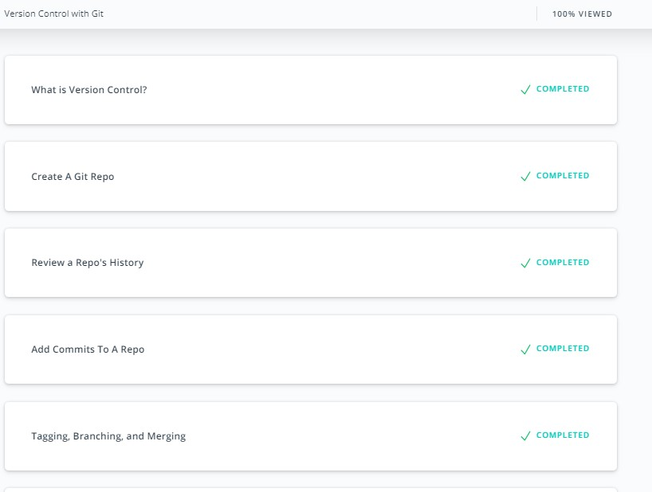

#### :key: Key takeaways
**VSC** Version control system is the same as **SCM** Source code manager.
#### Why to use version control system?
 VSC tracks changes into a project (a set of files) as separate steps. By this a historical roadmap of how we get to the current state of a project is written. It is possible to describes each change separately: what was done and why it was done. Main features of VCS are:
- let us understand where is some specific copy of a project vs. other copies on overall project's roadmap
- les us work with a project on any arbitrary stage of a roadmap
- work with each change separately:
  - appply it
  - review it later
  - change back with out effecting other changes including next one
  - resolve conflicts with other changes
#### Cetralized vs. Distributed VCS
Centralized VCS has single place to store all information (Subversion for example)

Distributed VCS provides each user with full project information on its own computer (Git, Mercurial).

Distributed VCS advantages:
- fast to move between versions (all data is local, it is done by copying files from repository to working tree)
- independent work with changes:
  - physically as no internet connection is required
  - team workflow as changes could be done only with personal version at first

Distributed VCS disadvantages:
- work with binary files is costy in terms of space to store all versions
- project with long history of changes requires time to download and space to store
- all project files available to each member thats increase exposure risks
#### Git project places
All local Git operations are done between three places:
- *Working tree* (**tree**) - files in project directory that are available for user to edit
- *Staging Index* (**index**) - freezed version of changed files ready to be committed into repository
- *Repository* (**repo**) - hidden folder that contains history of all committed changes
#### Git branches merge
There are two types of merges:
- *fast-forward merge* - if merging branch is directly ahead of current branch (current branch does not have any commits that are not in merging branch). Just moves the pointer of current branch to the pointer of merging branch
- *regular merge* - creates new commit that joins all different commits in both branches. If conflicts occur they should be resolved manually (files with conflict description will be added to working tree for editing and then staging)
#### Absolute Commit Reference
Commits could be referenced by
- branch pointers
- special pointer HEAD
- tags
- SHA (Secure Hash Algorithm)
#### Relative Commit Reference
Merge commit (in case of regular merge) has two parents:
- *first* parent the last commit of current branch in merge
- *second* parent the last commit of merged branch
Ancestry References:
- `^` - indicates the parent commit. `^` is single or *first* parent, `^2` - *second* parent
- `~` - indicates the *first* parent commit. Used as shorthand for number of *first* parent commits: `~3` equals `^^^`
Ancestry reference could be combined: `HEAD~4^2` - 4 parents back and then second parent in the merge
#### Git corrections
**Edit** only the last commit: `git commit --amend` - edit message of the last commit. And if files added to staging index, they will be added or replace the same files in repository for the last commit

**Change back** commit: `git revert` - creates new commit with opposite changes

**Delete** commits after specified one: `git reset` (set commits for deletion after ~30 days, they could be viewed with `git reflog`). Branch head is set to choosen commit. Possible impact on tree and index is defined by flag:
- `--soft` tree and index are unchagned
- `--mixed` (default) resets the index but not the working tree
- `--hard` resets the index and tree
#### Git cheatsheet and reference
Cheatsheet from basic to rebase: [Atlassin Bitbucket](https://www.atlassian.com/git/tutorials/atlassian-git-cheatsheet)

Not covered in the cheatsheet:
- `git tag` - create/delete special commit reference
- `git show` - show full information about commit (by default the last one)
- `git log --all` - all flag to show log from all branches in the repository, not only the current one

Git full reference and book: [git-scm](https://git-scm.com/doc)
#### :+1: Pros
Introduction to Git local usage without remote complication. Good structure of lessons by actions to perform: review, commit, branch, edit.
#### :-1: Cons
Rebase is not covered. Changes in Git v2.14 and later reflected only with notes but not incorporated into the course itself.
#### :bulb: New
Udoing changes in Git
#### :gift: Suprising
Google docs revision history
#### :hammer: Useful
First of all run command `git status` in every git directory

`git add .` adds all modified files from working tree into staging index except listed in `.gitignore` file 

Navigation in unix command line pager program: **less**
- down: j, d (*down* half page), f (*full* page down)
- up: k, u (*up* half page), b (*back* full page up)
- quit: q

Commit message body describes why change was done. To add it leave a blank line after commit message in editor.

Always put newline as last character of the file is a good style. It is possible to add this into preferences of a code editor.

[:arrow_up_small: Back to this task content](#git-basics)

### [Learn Git Branching - first sections](https://learngitbranching.js.org/)
Main: Introduction Sequence

Remote: Push&Pull -- Git Remotes!

Screenshots

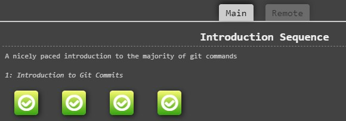
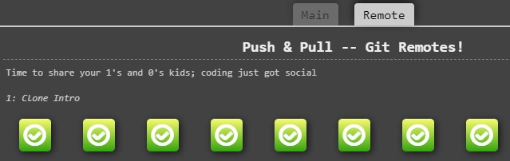

#### :key: Key takeaways
#### Remote repository
Remote repositories provide two advantages:
- backup of your local repository
- synchronize team work on the same project
#### Remote branch
When cloning git creates special branch: `<remote repo name>/<branch name>`. Usually remote is called origin. This branch work in HEAD detached mode: branch pointer does not move with new commits, only fetching from remote updates branch pointer. Commits in detached mode could be used for experimantal changes.
#### Remote git commands
`git fetch` - only updates remote branch to their state at the moment, does not perform changes to local branches

`git pull` - shorthand for two commands `git fetch; git merge remote/branch`

`git pull --rebase` - shorthand for two commands `git fetch; git rebase remote/branch`

`git push` - allowed only after updating state of remote in local repository
#### :+1: Pros
Good visualization of git graph to play with:
- Shows difference between merge and rebase
- Shows work with remote branches
#### :-1: Cons
It does not fully replace practice with real git repositories. You still need to train all commands with real repository.
#### :bulb: New
`git rebase` to make project history straightforward.
#### :gift: Suprising
git HEAD detached mode for experimenting
#### :hammer: Useful
`git checkout -b <branch name> <commit>` creating branch and checking it out at specific commit

[:arrow_up_small: Back to this task content](#git-basics)

01. Linux CLI and Networking

## Linux CLI, and HTTP
- [Linux Survival (4 modules)](#linux-survival)
- [HTTP: The Protocol Every Web Developer Must Know - Part 1](#http-the-protocol-every-web-developer-must-know---part-1)
- [HTTP: The Protocol Every Web Developer Must Know - Part 2](#http-the-protocol-every-web-developer-must-know---part-2)

### [Linux Survival](https://linuxsurvival.com/)

Screenshots

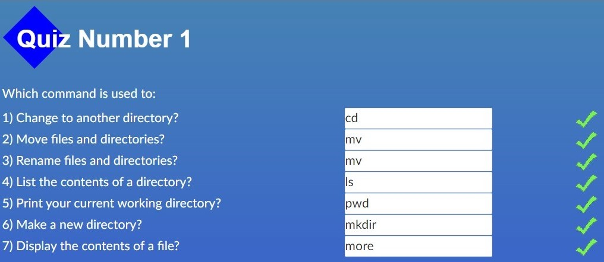
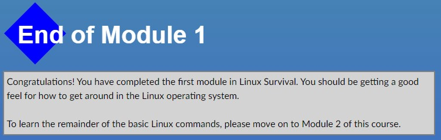
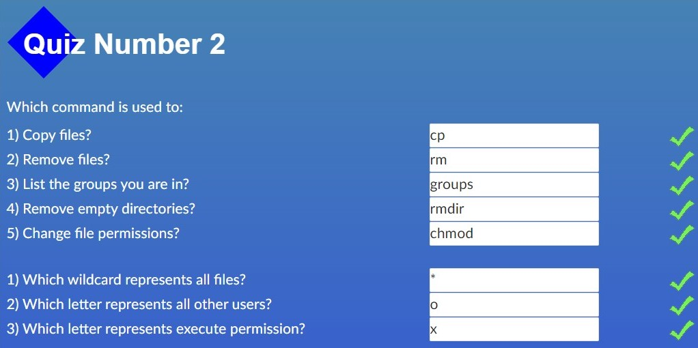
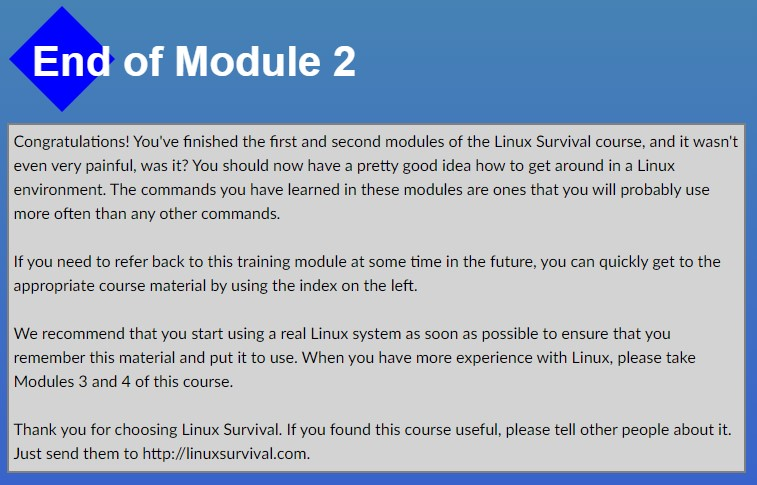
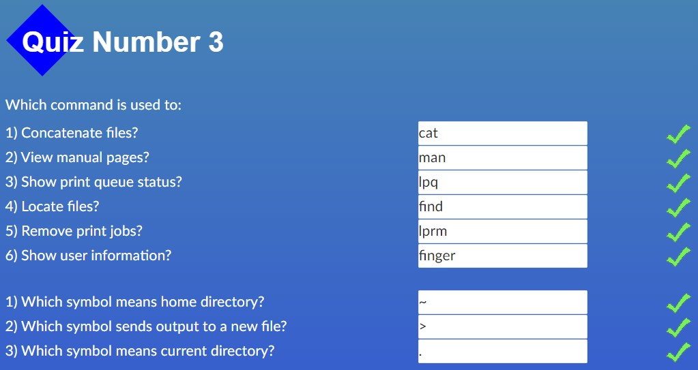
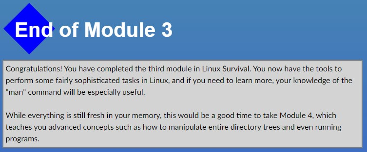
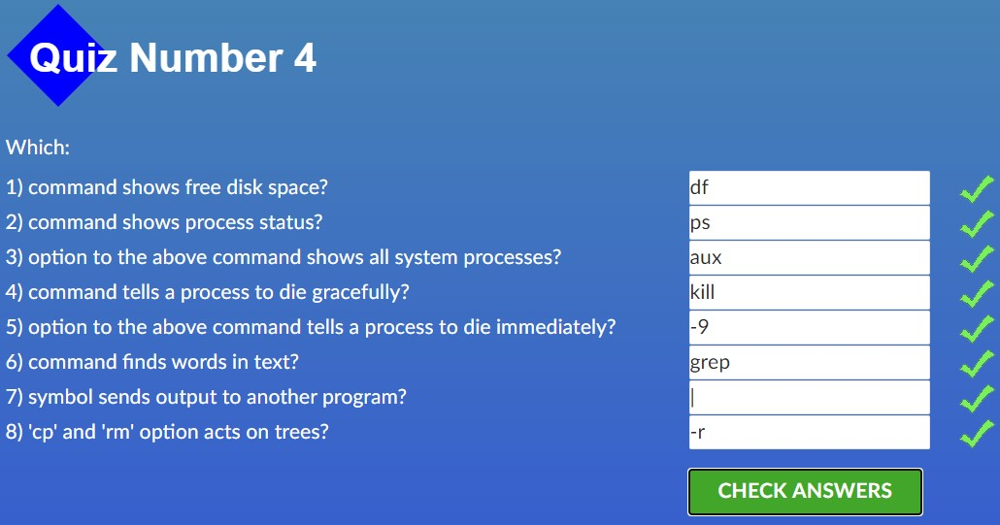
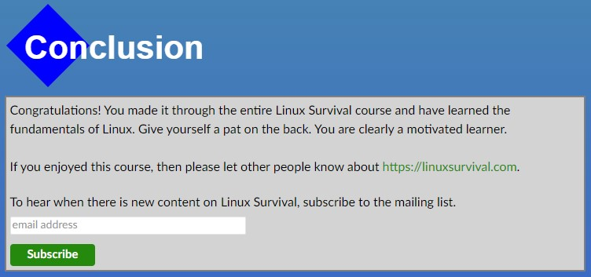

#### :key: Key takeaways
#### Command #1 to know what do to
`man [-k] <keyword>`
- without `-k` is help about specific command
- with `-k` is a search around all manual for specific keyword
#### Directories shortcuts
- `~user` - home directory of specific user, for current user just `~` could be used
- `.` - current directory
- `..` - directory one level up
#### File permissions
9 bits (3 bits permissions * 3 levels of users)
- levels: user - group - other (ugo)
- permissions: read - write - execute (rwx)
`chmod ugo+rwx file` - letters for users level, add/remove (+/-), letters of specific rights
#### :+1: Pros
Covered essential things to start working with Linux command line and ways to find more information later in practice.
#### :-1: Cons
Outdated content regarding work with printers. Nowdays it would be far more relevant content with command line tools to work with internet like: `wget`

Not explaind that `more` is a pager programm and there is more modern `less` pager.

Fuzzy explanation about `-r` flag for working with directories as with a whole tree, not as recursive operation
#### :bulb: New
Limitation of asigning file permissions to only 1 group, thus need for additional technics for more sophisticated file access control (users from different groups)
#### :gift: Suprising
Single tree aproach in Linux with mounting physical disks as ordinal directories in the tree.

Multi-user approach in Linux from the start
#### :hammer: Useful
Pipeline of one program results into other: for example `ps aux | grep <command>` list processes from all users that are executing now and send it to grep for filtering only lines with specific command.

Send text to other file: `>` by creating new one, `>>` appending to existing one if there is one. For example `cat file1.txt file2.txt >> summary.txt`

[:arrow_up_small: Back to this task content](#linux-cli-and-http)

### [HTTP: The Protocol Every Web Developer Must Know - Part 1](https://code.tutsplus.com/tutorials/http-the-protocol-every-web-developer-must-know-part-1--net-31177)

#### :key: Key takeaways
#### HTTP
- text based communication protocol not tied to specific system requirements, a way of interaction agreed in headers of messages
- stateless, it is initiated by request and ended with responce(s), state of connection/communication is not saved between requests
#### Message structure
`<start line>` request-line or status-line

`<message header(s)>` a list of `field-name : field-value` pairs to agree on communication parameters

`<message body>` a content itself
#### Request-line
`Method URI HTTP-Version`

Most common methods (actions that client requests from server):
- GET - fetch an existing resource
- POST - create a new resource
- PUT - update an existing resource
- DELETE - delete an existing resource
#### Status-line
`HTTP-Version Status-Code Reason-Pharase`

Groups of status-code:
- 1xx - Information Messages
- 2xx - Successful
- 3xx - Redirection
- 4xx - Client Error
- 5xx - Server Error
#### Headers classification
- general headers - used by both request and respond messages
- request specific headers
- respond specific headers
- entity (message body) specific headers
#### :+1: Pros
None
#### :-1: Cons
Messy article that overcomplicate things. It tries to be for beginners and at the same time to give specific details.

It is very badly structured: client request methods and server responce statuses explained before explaining message structure overall; headers listed before explaining before request-line and status-line

It is outdated in terms of tools and framework specific (publication date is 2013-04-08)
#### :bulb: New
Nothing
#### :gift: Suprising
Nothing
#### :hammer: Useful
Nothing

[:arrow_up_small: Back to this task content](#linux-cli-and-http)

### [HTTP: The Protocol Every Web Developer Must Know - Part 2](https://code.tutsplus.com/tutorials/http-the-protocol-every-web-developer-must-know-part-2--net-31155)

#### :key: Key takeaways
#### HTTP connection
Internet layer:
- IP - is protocol for connection between devices

Transport layer:
- TCP - is transfering data protocol over IP

Application layer:
- HTTP - protocol of how application communicate over TCP
- TLS - Transport layer security protocol
- HTTPS - protocol of how applications communicate over TCP using TLS

*Persistent connection* - to avoid establishing TCP/IP connection for each HTTP request it is kept alive until client sends request with header: `Connection: close`. It is default in HTTP/1.1

*Parallel connections* - to minimize network delays client could establish multiple connection to server, separately for each resource to be downloaded
#### Identification and Authentication
Ways a server can collect identification information:
- request headers
- client IP
- fat URLs (modifing URL for each user)
- cookies - session data as set of key=value pairs
#### HTTP Cache
To avoide same work done twice a cache of data is used

Cache storing:
- private - user specific data is stored on client machine
- public - to serve multiple users frequently requested data is stored on proxy server between clients and original server

Expiration of resource is controled by `Cache-Control` header that could be both used for request and respond.

After expiration client can request *server revalidation* of chached resource.
#### :+1: Pros
Good explanation of connection as laying one protocol over other.

Good explanation about avoiding double work with persistent connection and using cache.
#### :-1: Cons
Messy article of very basic and more complicated things.

Not clear how up to date is this article about security and authentication.
#### :bulb: New
Understanding that TSL is between TCP and HTTPs

Client can open several connection to the same server to minimize network delays
#### :gift: Suprising
HTTP connection is not closed after sending response by default
#### :hammer: Useful
Ways cache could be controled by both client and server using `Cache-Control` header

[:arrow_up_small: Back to this task content](#linux-cli-and-http)

02. GitHub and Collaboration

## Git Collaboration
- [Udacity course: GitHub & Collaboration](#github--collaboration)
- [Visual interactive course: Learn Git Branching](#learn-git-branching)

### [GitHub & Collaboration](https://classroom.udacity.com/courses/ud456)

Screenshots

#### :key: Key takeaways
#### Remote repositories
There could be multiple remote repositories:
- direct collaboration between developers omiting major project repository, used for work in progress cooperation before commits into major repository
- separate resositories for source code maintaining and deploying

*Tracking branch* - local branch named `<remote>/<branch>` is used to reflect state of remote branch at the moment of the last synchronization. It is in detached HEAD mode - not updated locally.

`git remote` for managing remote repositories links

`git remote add <shortname> <repository path>`

`git push <remote> <local branch>` - uploads new commits from local branch to remote repository and fast-forward merge

`git push -f` (*--force*) - uploads commits from local branch and replaces on remote, if local and remote branches have diverged and fast-forard merge is not possible.

`git fetch <remote> <branch>` - updates tracking branch with new commits from remote

`git pull <remote> <branch>` - updates tracking branch with new commits from remote and merges them into local branch
#### Filtering Git log
`git log --author=` - filters git log by commit author

`git log --grep=` - filter git log by string containing in commit message and its body, works the same as grep command in linux.
#### Collaboration workflow
`CONTRIBUTING.md` file contains all rulls and requirements for contributing into a project

*Issues* are used to discuss need of some changes into project

*Topic branch* is a git branch in a fork to work on specific code update.
#### :+1: Pros
Solid explanation of workflow with remotes repositories and collaborating via pull requests.
#### :-1: Cons
Course is available only via direct link and is not listed in Udacity catalog. Udacity can treat it as outdated or not relevant.
#### :bulb: New
How powerfull is `git rebase -i` (interactive) for changing repository (editing, deleting, joining, reodering commits)
#### :gift: Suprising
Updating branch used for pull request will update automatically pull request. It is very logically and convinient for collaboration.
#### :hammer: Useful
Commonly used, but not required, naming for remotes:
- *origin* - your own remote repository
- *upstream* - major source repository of a project

`git rebase` useage caveat: :no_entry: Don't rebase public history, it will break track of past commits in other people repositories and theirs work will not be tied to newly rebased repository

[:arrow_up_small: Back to this task content](#git-collaboration)

### [Learn Git Branching](https://learngitbranching.js.org/)

Screenshots

#### :key: Key takeaways
#### :+1: Pros
#### :-1: Cons
#### :bulb: New
#### :gift: Suprising
#### :hammer: Useful

[:arrow_up_small: Back to this task content](#git-collaboration)

