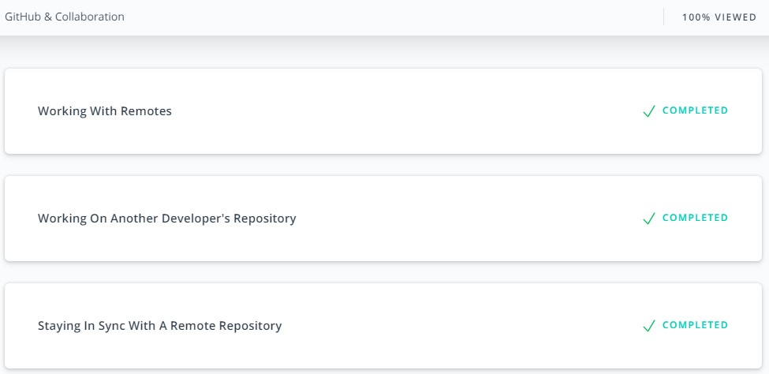
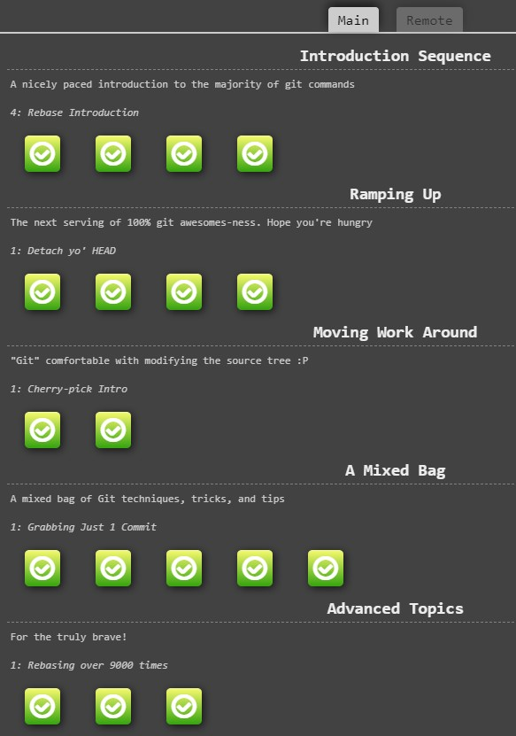

# Kottans Front-End 2020/2021 reflections
Repository for my personal reflections, code and notes about [Front-End Course](https://github.com/kottans/frontend) (version 2020-2021) provided by [Kottans community](https://kottans.org/) :cat2:

# Stage 0

`00` [Git Basics](#git-basics)
- [Udacity: Version Control with Git](#udacity-version-control-with-git)
- [Learn Git Branching - first sections](#learn-git-branching---first-sections)

`01` [Linux CLI, and HTTP](#linux-cli-and-http)
- [Linux Survival (4 modules)](#linux-survival)
- [HTTP: The Protocol Every Web Developer Must Know - Part 1](#http-the-protocol-every-web-developer-must-know---part-1)
- [HTTP: The Protocol Every Web Developer Must Know - Part 2](#http-the-protocol-every-web-developer-must-know---part-2)

`02` [Git Collaboration](#git-collaboration)
- [Udacity: GitHub & Collaboration](#udacity-github--collaboration)
- [Learn Git Branching](#learn-git-branching)

`03` [Intro to HTML and CSS](#intro-to-html-and-css)
- [Udacity: Intro to HTML and CSS](#udacity-intro-to-html-and-css)
- [codecademy: Learn HTML](#codecademy-learn-html)
- [codecademy: Learn CSS](#codecademy-learn-css)

`04` [Responsive Web Design](#responsive-web-design)
- [Udacity: Responsive Web Design Fundamentals](#udacity-responsive-web-design-fundamentals)
- [Game: Flexbox froggy](#game-flexbox-froggy)

`06` [JS Basics](#js-basics)
- [Udacity: Intro to JavaScript](#udacity-intro-to-javascript)
- [freeCodeCamp: Intro to JavaScript](#freecodecamp-basic-javascript)
- [freeCodeCamp: ES6](#freecodecamp-es6)
- [freeCodeCamp: Basic Data Structures](#freecodecamp-basic-data-structures)
- [freeCodeCamp: Basic Algorithm Scripting](#freecodecamp-basic-algorithm-scripting)

## Git Basics
- [Udacity: Version Control with Git](#udacity-version-control-with-git)
- [Learn Git Branching - first sections](#learn-git-branching---first-sections)

### [Udacity: Version Control with Git](https://www.udacity.com/course/version-control-with-git--ud123)

Screenshots

#### :key: Key takeaways
**VSC** Version control system is the same as **SCM** Source code manager.
#### Why to use version control system?
 VSC tracks changes into a project (a set of files) as separate steps. By this a historical roadmap of how we get to the current state of a project is written. It is possible to describes each change separately: what was done and why it was done. Main features of VCS are:
- let us understand where is some specific copy of a project vs. other copies on overall project's roadmap
- les us work with a project on any arbitrary stage of a roadmap
- work with each change separately:
  - appply it
  - review it later
  - change back with out effecting other changes including next one
  - resolve conflicts with other changes
#### Cetralized vs. Distributed VCS
Centralized VCS has single place to store all information (Subversion for example)

Distributed VCS provides each user with full project information on its own computer (Git, Mercurial).

Distributed VCS advantages:
- fast to move between versions (all data is local, it is done by copying files from repository to working tree)
- independent work with changes:
  - physically as no internet connection is required
  - team workflow as changes could be done only with personal version at first

Distributed VCS disadvantages:
- work with binary files is costy in terms of space to store all versions
- project with long history of changes requires time to download and space to store
- all project files available to each member thats increase exposure risks
#### Git project places
All local Git operations are done between three places:
- *Working tree* (**tree**) - files in project directory that are available for user to edit
- *Staging Index* (**index**) - freezed version of changed files ready to be committed into repository
- *Repository* (**repo**) - hidden folder that contains history of all committed changes
#### Git branches merge
There are two types of merges:
- *fast-forward merge* - if merging branch is directly ahead of current branch (current branch does not have any commits that are not in merging branch). Just moves the pointer of current branch to the pointer of merging branch
- *regular merge* - creates new commit that joins all different commits in both branches. If conflicts occur they should be resolved manually (files with conflict description will be added to working tree for editing and then staging)
#### Absolute Commit Reference
Commits could be referenced by
- branch pointers
- special pointer HEAD
- tags
- SHA (Secure Hash Algorithm)
#### Relative Commit Reference
Merge commit (in case of regular merge) has two parents:
- *first* parent the last commit of current branch in merge
- *second* parent the last commit of merged branch
Ancestry References:
- `^` - indicates the parent commit. `^` is single or *first* parent, `^2` - *second* parent
- `~` - indicates the *first* parent commit. Used as shorthand for number of *first* parent commits: `~3` equals `^^^`
Ancestry reference could be combined: `HEAD~4^2` - 4 parents back and then second parent in the merge
#### Git corrections
**Edit** only the last commit: `git commit --amend` - edit message of the last commit. And if files added to staging index, they will be added or replace the same files in repository for the last commit

**Change back** commit: `git revert` - creates new commit with opposite changes

**Delete** commits after specified one: `git reset` (set commits for deletion after ~30 days, they could be viewed with `git reflog`). Branch head is set to choosen commit. Possible impact on tree and index is defined by flag:
- `--soft` tree and index are unchagned
- `--mixed` (default) resets the index but not the working tree
- `--hard` resets the index and tree
#### Git cheatsheet and reference
Cheatsheet from basic to rebase: [Atlassin Bitbucket](https://www.atlassian.com/git/tutorials/atlassian-git-cheatsheet)

Not covered in the cheatsheet:
- `git tag` - create/delete special commit reference
- `git show` - show full information about commit (by default the last one)
- `git log --all` - all flag to show log from all branches in the repository, not only the current one

Git full reference and book: [git-scm](https://git-scm.com/doc)
#### :+1: Pros
Introduction to Git local usage without remote complication. Good structure of lessons by actions to perform: review, commit, branch, edit.
#### :-1: Cons
Rebase is not covered. Changes in Git v2.14 and later reflected only with notes but not incorporated into the course itself.
#### :bulb: New
Udoing changes in Git
#### :gift: Suprising
Google docs revision history
#### :hammer: Useful
First of all run command `git status` in every git directory

`git add .` adds all modified files from working tree into staging index except listed in `.gitignore` file 

Navigation in unix command line pager program: **less**
- down: j, d (*down* half page), f (*full* page down)
- up: k, u (*up* half page), b (*back* full page up)
- quit: q

Commit message body describes why change was done. To add it leave a blank line after commit message in editor.

Always put newline as last character of the file is a good style. It is possible to add this into preferences of a code editor.

[:arrow_up_small: Back to this task content](#git-basics)

[:arrow_double_up: Back to Stage 0 content](#stage-0)

### [Learn Git Branching - first sections](https://learngitbranching.js.org/)
Main: Introduction Sequence

Remote: Push&Pull -- Git Remotes!

Screenshots

#### :key: Key takeaways
#### Remote repository
Remote repositories provide two advantages:
- backup of your local repository
- synchronize team work on the same project
#### Remote branch
When cloning git creates special branch: `<remote repo name>/<branch name>`. Usually remote is called origin. This branch work in HEAD detached mode: branch pointer does not move with new commits, only fetching from remote updates branch pointer. Commits in detached mode could be used for experimantal changes.
#### Remote git commands
`git fetch` - only updates remote branch to their state at the moment, does not perform changes to local branches

`git pull` - shorthand for two commands `git fetch; git merge remote/branch`

`git pull --rebase` - shorthand for two commands `git fetch; git rebase remote/branch`

`git push` - allowed only after updating state of remote in local repository
#### :+1: Pros
Good visualization of git graph to play with:
- Shows difference between merge and rebase
- Shows work with remote branches
#### :-1: Cons
It does not fully replace practice with real git repositories. You still need to train all commands with real repository.
#### :bulb: New
`git rebase` to make project history straightforward.
#### :gift: Suprising
git HEAD detached mode for experimenting
#### :hammer: Useful
`git checkout -b <branch name> <commit>` creating branch and checking it out at specific commit

[:arrow_up_small: Back to this task content](#git-basics)

[:arrow_double_up: Back to Stage 0 content](#stage-0)

## Linux CLI, and HTTP
- [Linux Survival (4 modules)](#linux-survival)
- [HTTP: The Protocol Every Web Developer Must Know - Part 1](#http-the-protocol-every-web-developer-must-know---part-1)
- [HTTP: The Protocol Every Web Developer Must Know - Part 2](#http-the-protocol-every-web-developer-must-know---part-2)

### [Linux Survival](https://linuxsurvival.com/)

Screenshots

#### :key: Key takeaways
#### Command #1 to know what do to
`man [-k] <keyword>`
- without `-k` is help about specific command
- with `-k` is a search around all manual for specific keyword
#### Directories shortcuts
- `~user` - home directory of specific user, for current user just `~` could be used
- `.` - current directory
- `..` - directory one level up
#### File permissions
9 bits (3 bits permissions * 3 levels of users)
- levels: user - group - other (ugo)
- permissions: read - write - execute (rwx)
`chmod ugo+rwx file` - letters for users level, add/remove (+/-), letters of specific rights
#### :+1: Pros
Covered essential things to start working with Linux command line and ways to find more information later in practice.
#### :-1: Cons
Outdated content regarding work with printers. Nowdays it would be far more relevant content with command line tools to work with internet like: `wget`

Not explaind that `more` is a pager programm and there is more modern `less` pager.

Fuzzy explanation about `-r` flag for working with directories as with a whole tree, not as recursive operation
#### :bulb: New
Limitation of asigning file permissions to only 1 group, thus need for additional technics for more sophisticated file access control (users from different groups)
#### :gift: Suprising
Single tree aproach in Linux with mounting physical disks as ordinal directories in the tree.

Multi-user approach in Linux from the start
#### :hammer: Useful
Pipeline of one program results into other: for example `ps aux | grep <command>` list processes from all users that are executing now and send it to grep for filtering only lines with specific command.

Send text to other file: `>` by creating new one, `>>` appending to existing one if there is one. For example `cat file1.txt file2.txt >> summary.txt`

[:arrow_up_small: Back to this task content](#linux-cli-and-http)

[:arrow_double_up: Back to Stage 0 content](#stage-0)

### [HTTP: The Protocol Every Web Developer Must Know - Part 1](https://code.tutsplus.com/tutorials/http-the-protocol-every-web-developer-must-know-part-1--net-31177)

#### :key: Key takeaways
#### HTTP
- text based communication protocol not tied to specific system requirements, a way of interaction agreed in headers of messages
- stateless, it is initiated by request and ended with responce(s), state of connection/communication is not saved between requests
#### Message structure
`<start line>` request-line or status-line

`<message header(s)>` a list of `field-name : field-value` pairs to agree on communication parameters

`<message body>` a content itself
#### Request-line
`Method URI HTTP-Version`

Most common methods (actions that client requests from server):
- GET - fetch an existing resource
- POST - create a new resource
- PUT - update an existing resource
- DELETE - delete an existing resource
#### Status-line
`HTTP-Version Status-Code Reason-Pharase`

Groups of status-code:
- 1xx - Information Messages
- 2xx - Successful
- 3xx - Redirection
- 4xx - Client Error
- 5xx - Server Error
#### Headers classification
- general headers - used by both request and respond messages
- request specific headers
- respond specific headers
- entity (message body) specific headers
#### :+1: Pros
None
#### :-1: Cons
Messy article that overcomplicate things. It tries to be for beginners and at the same time to give specific details.

It is very badly structured: client request methods and server responce statuses explained before explaining message structure overall; headers listed before explaining before request-line and status-line

It is outdated in terms of tools and framework specific (publication date is 2013-04-08)
#### :bulb: New
Nothing
#### :gift: Suprising
Nothing
#### :hammer: Useful
Nothing

[:arrow_up_small: Back to this task content](#linux-cli-and-http)

[:arrow_double_up: Back to Stage 0 content](#stage-0)

### [HTTP: The Protocol Every Web Developer Must Know - Part 2](https://code.tutsplus.com/tutorials/http-the-protocol-every-web-developer-must-know-part-2--net-31155)

#### :key: Key takeaways
#### HTTP connection
Internet layer:
- IP - is protocol for connection between devices

Transport layer:
- TCP - is transfering data protocol over IP

Application layer:
- HTTP - protocol of how application communicate over TCP
- TLS - Transport layer security protocol
- HTTPS - protocol of how applications communicate over TCP using TLS

*Persistent connection* - to avoid establishing TCP/IP connection for each HTTP request it is kept alive until client sends request with header: `Connection: close`. It is default in HTTP/1.1

*Parallel connections* - to minimize network delays client could establish multiple connection to server, separately for each resource to be downloaded
#### Identification and Authentication
Ways a server can collect identification information:
- request headers
- client IP
- fat URLs (modifing URL for each user)
- cookies - session data as set of key=value pairs
#### HTTP Cache
To avoide same work done twice a cache of data is used

Cache storing:
- private - user specific data is stored on client machine
- public - to serve multiple users frequently requested data is stored on proxy server between clients and original server

Expiration of resource is controled by `Cache-Control` header that could be both used for request and respond.

After expiration client can request *server revalidation* of chached resource.
#### :+1: Pros
Good explanation of connection as laying one protocol over other.

Good explanation about avoiding double work with persistent connection and using cache.
#### :-1: Cons
Messy article of very basic and more complicated things.

Not clear how up to date is this article about security and authentication.
#### :bulb: New
Understanding that TSL is between TCP and HTTPs

Client can open several connection to the same server to minimize network delays
#### :gift: Suprising
HTTP connection is not closed after sending response by default
#### :hammer: Useful
Ways cache could be controled by both client and server using `Cache-Control` header

[:arrow_up_small: Back to this task content](#linux-cli-and-http)

[:arrow_double_up: Back to Stage 0 content](#stage-0)

## Git Collaboration
- [Udacity: GitHub & Collaboration](#udacity-github--collaboration)
- [Learn Git Branching](#learn-git-branching)

### [Udacity: GitHub & Collaboration](https://classroom.udacity.com/courses/ud456)

Screenshots

#### :key: Key takeaways
#### Remote repositories
There could be multiple remote repositories:
- direct collaboration between developers omiting major project repository, used for work in progress cooperation before commits into major repository
- separate resositories for source code maintaining and deploying

*Tracking branch* - local branch named `<remote>/<branch>` is used to reflect state of remote branch at the moment of the last synchronization. It is in detached HEAD mode - not updated locally.

`git remote` for managing remote repositories links

`git remote add <shortname> <repository path>`

`git push <remote> <local branch>` - uploads new commits from local branch to remote repository and fast-forward merge

`git push -f` (*--force*) - uploads commits from local branch and replaces on remote, if local and remote branches have diverged and fast-forard merge is not possible.

`git fetch <remote> <branch>` - updates tracking branch with new commits from remote

`git pull <remote> <branch>` - updates tracking branch with new commits from remote and merges them into local branch
#### Filtering Git log
`git log --author=` - filters git log by commit author

`git log --grep=` - filter git log by string containing in commit message and its body, works the same as grep command in linux.
#### Collaboration workflow
`CONTRIBUTING.md` file contains all rulls and requirements for contributing into a project

*Issues* are used to discuss need of some changes into project

*Topic branch* is a git branch in a fork to work on specific code update.
#### :+1: Pros
Solid explanation of workflow with remotes repositories and collaborating via pull requests.
#### :-1: Cons
Course is available only via direct link and is not listed in Udacity catalog. Udacity can treat it as outdated or not relevant.
#### :bulb: New
How powerfull is `git rebase -i` (interactive) for changing repository (editing, deleting, joining, reodering commits)
#### :gift: Suprising
Updating branch used for pull request will update automatically pull request. It is very logically and convinient for collaboration.
#### :hammer: Useful
Commonly used, but not required, naming for remotes:
- *origin* - your own remote repository
- *upstream* - major source repository of a project

`git rebase` useage caveat: :no_entry: Don't rebase public history, it will break track of past commits in other people repositories and theirs work will not be tied to newly rebased repository

[:arrow_up_small: Back to this task content](#git-collaboration)

[:arrow_double_up: Back to Stage 0 content](#stage-0)

### [Learn Git Branching](https://learngitbranching.js.org/)

Screenshots

#### :key: Key takeaways
#### HEAD pointer
*HEAD* - points to the most recent commit which is reflected in the working tree (the one that is currently checkouted). Checking out specific commit transfers HEAD in detached state, not pointing to any branch. This is usefull for experimenting with out saving to any branch.
#### Moving branches
`git branch -f <branch name> <commit>` - forcefully moves branch pointer to specific commit

`git rebase -i <commit refference>` - takes all unique commits from current branch and moves them straighline starting from specified commit (could be other branch name)
#### Remotes tracking and synchronizing
By default there are tracking branches with the same name as local and remote: remote *main*, local *main*, tracking branch `<remote>/main`.

`git branch -u <remote>/<branch> <some local branch>` - arbitrary sets local branch with any name to track remote one

`git push <remote> <place>` - pushes the same name branch from local to remote, there is no need to checkout local branch

`git push <remote> <source>:<destination>` - pushes new commits upto source (any commit reference) to remote starting from destination commit
#### :+1: Pros
Great visualization and explanation of git commands
#### :-1: Cons
You still need to practice with real repositories to get skills
#### :bulb: New
`git cherry-pick <commit> ... <commit>` - very straightforward and flexible way to manage commits on the branch
#### :gift: Suprising
Deleting branch in remote repository with specifying *nothing* as source for push: `git push <remote> :<destination>` (destination is a branch in remote repository)
#### :hammer: Useful
Comparison of *merge* and *rebase*:
- `git rebase` - let you have straight line trach of changes
- `git merge` - let you preserve historical order how changeds where made

[:arrow_up_small: Back to this task content](#git-collaboration)

[:arrow_double_up: Back to Stage 0 content](#stage-0)

## Intro to HTML and CSS
- [Udacity: Intro to HTML and CSS](#udacity-intro-to-html-and-css)
- [codecademy: Learn HTML](#codecademy-learn-html)
- [codecademy: Learn CSS](#codecademy-learn-css)

### [Udacity: Intro to HTML and CSS](https://www.udacity.com/course/intro-to-html-and-css--ud001)

Screenshots

#### :key: Key takeaways
None
#### :+1: Pros
None
#### :-1: Cons
Content quality of this course is not consistent. It gives very rough understanding of HTML and CSS, accompanied with sporadic practice. Tasks don't give any solid understanding of what you are doing.

It is better not to spend time for this course even for those who know nothing about HTML and CSS.
#### :bulb: New
None
#### :gift: Suprising
None
#### :hammer: Useful
Links to great references:
- [Mozilla HTML reference](https://developer.mozilla.org/en-US/docs/Web/HTML/Element)
- [Mozilla CSS reference](https://developer.mozilla.org/en-US/docs/Web/CSS/Reference)
- [CSS Tricks - Almanac](https://css-tricks.com/almanac/)

[:arrow_up_small: Back to this task content](#intro-to-html-and-css)

[:arrow_double_up: Back to Stage 0 content](#stage-0)

### [codecademy: Learn HTML](https://www.codecademy.com/learn/learn-html)

#### :key: Key takeaways
**Metadata** - information about the page that is not displayed directly on the page

HTML for structure and semantics.

Non semantic elements:
- `
` - block element
- `` - inline element

Semantic elements:
- `<main>`
- `<header>`
- `<footer>`
- `<nav>`
- `<aside>`
- `<section>`
- `<article>`
#### :+1: Pros
Neat and clear indroduction into HTML. All basic questions are covered with practice even in free version.
#### :-1: Cons
None
#### :bulb: New
`<datalist>` element for `<input type="text">` - to populate with options list

*pattern* attribute for `<input type="text>` to validate input on client-side
#### :gift: Suprising
Alternative text of an image for SEO.
#### :hammer: Useful
Cheatsheets:
- [Elements and structure](https://www.codecademy.com/learn/learn-html/modules/learn-html-elements/cheatsheet)
- [Tables](https://www.codecademy.com/learn/learn-html/modules/learn-html-tables/cheatsheet)
- [Forms](https://www.codecademy.com/learn/learn-html/modules/learn-html-forms/cheatsheet)
- [Semantic HTML](https://www.codecademy.com/learn/learn-html/modules/learn-semantic-html/cheatsheet)

[:arrow_up_small: Back to this task content](#intro-to-html-and-css)

[:arrow_double_up: Back to Stage 0 content](#stage-0)

### [codecademy: Learn CSS](https://www.codecademy.com/learn/learn-css)

#### :key: Key takeaways
#### Box model

Visual box model

`display:`
- *inline*
- *block*
- *inline-block* (inline, but have size, for example image)
- *flex*
- *inline-flex*
- *grid*
- *inline-grid*

`position:`
- *static* - default, according to HTML flow
- *relative* - relative to element's own static position
- *absolute* - relative to parent element position, ignored in HTML flow, don't have there own static position
- *fixed* - relative to screen

`z-index` - oder of overlapping elements, larger number goes on top

Block element size properties:
- `min-width`, `width`, `max-width`
- `min-height`, `heigth`, `max-height`

`overflow:` - block element behavior with content exceeding size of element: *visible* (default), *hidden*, *sroll*, *auto*

`float` and `clear` properties defines how element floats within parent element and how should behave when it bumps into other another sibling element

#### Colors
- named
- RGB hex
- functions: `rbg()`, `rgba()`, `hsl()`, `hsla()` - *alpha* is opacity level from 0 (transperant) to 1 (fully filled)
#### Fonts
Font types:
- *serif* - with strokes
- *san-serif* - with-out strokes, more neat at low-resolution screens
- *monospace* - all letters has same size

Spacing properties:
- `word-spacing`
- `letter-spacing`
- `line-height` - it is sum of font size and leading

Font weight

Numeric values from 100 to 900.
- *light* - 300
- *default* - 400
- *bold* - 700
#### Flexbox (flexible box layout)
Flex containers respond to changes in screen sizes. Flexboxes can be nested.

Flex containers properties:
- `justify-content` (align columns)
- `align-content` (align rows)
- `align-items` (align elements in ther rows)
- `flex-flow` unites two properties: `flex-wrap` and `flex-direction`

Flex items properties:
- `flex` unites three properties
  - `flex-grow` - index of increase
  - `flex-shrink` - index of decrease
  - `flex-basis` - base size

#### CSS Grid
Grid is used to layout the whole page.

Grid containers properties:
- `grid template: [rows] / [columns]`. Can be used functions repeat() and minmax(). Unites two properties:
  - `grid-template-rows`
  - `grid-template-columns`
- `grid-temaplate-areas: "..."` used to create grid with shorthand named sections 
- `grid-gap` unites two properties:
  - `grid-row-gap`
  - `grid-column-gap`
- `justify-items` (position elements in their columns)
- `justify-content` (position columns itself)
- `align-items`
- `align-content`

Implicit grid behavior for adding items over grid: items will fill up rows adding new rows as necessary with size of new rows just enough for content. Explicit grid grow properties:
- `grid-auto-flow` (rows or columns)
- `grid-auto-rows`
- `grid-auto-columns`

Grid items properties:
- `grid-area: start-row / start_column / end_row / end_column` end values are exclusive. Can be set with `span #`. Unites properties:
  - `grid-row`:
    - `grid-row-start`
    - `grid-row-end`
  - `grid-column`:
    - `grid-column-start`
    - `grid-column-end`
- `align-self` - overrides parent grid container value for align property
- `justify-self` - overrides parent grid container value for justify property

#### Transition properties
`transition` - shorthand for 4 properties:
- `transition-property` - keyword `all` can be used to set same transition rules for all properties
- `transition-duration`
- `transition-timing-function`
- `transition-delay`
#### :+1: Pros
Strutured and comprehensive CSS course that covered all tools needed to start. Good practice excersizes even in free version.
#### :-1: Cons
None
#### :bulb: New
`background-image` - property to set image as background of block element

It is possible to set base for box size with property: `box-sizing`
- *content-box* - size of element is size of content
- *border-box* - size of element is total size of border, padding and content

Fonts can be added in CSS style sheet with `@font-face {...details...}`

#### :gift: Suprising
Left and right margins in box model don't collapse, adds together
Top and bottom margins in box model collapse, the largerst one effective 

**HSL** (Hue Saturation Lightness) is usefull to make set of colors with the same saturation and lightness but different hue. To do it with RGB is far more complex.

CSS has functions for grid model: `repeat(times, pattern)` and `minmax(minimum_size maximum_size)`
#### :hammer: Useful
References:
- [CSS Selectors](https://developer.mozilla.org/en-US/docs/Learn/CSS/Building_blocks/Selectors)
- [Using CSS transitions](https://developer.mozilla.org/en-US/docs/Web/CSS/CSS_Transitions/Using_CSS_transitions)

Cheatsheets:
- [Selectors and Visual Rules](https://www.codecademy.com/learn/learn-css/modules/learn-css-selectors-visual-rules/cheatsheet)
- [The Box Model](https://www.codecademy.com/learn/learn-css/modules/learn-css-box-model/cheatsheet)
- [Display and Positioning](https://www.codecademy.com/learn/learn-css/modules/learn-css-display-positioning/cheatsheet)
- [Colors](https://www.codecademy.com/learn/learn-css/modules/learn-css-colors/cheatsheet)
- [Typography](https://www.codecademy.com/learn/learn-css/modules/learn-css-typography/cheatsheet)
- [Layout with Flexbox](https://www.codecademy.com/learn/learn-css/modules/layout-with-flexbox/cheatsheet)
- [Grid](https://www.codecademy.com/learn/learn-css/modules/learn-css-grid/cheatsheet)

[:arrow_up_small: Back to this task content](#intro-to-html-and-css)

[:arrow_double_up: Back to Stage 0 content](#stage-0)

## Responsive Web Design
- [Udacity: Responsive Web Design Fundamentals](#udacity-responsive-web-design-fundamentals)
- [Game: Flexbox froggy](#game-flexbox-froggy)

### [Udacity: Responsive Web Design Fundamentals](https://www.udacity.com/course/responsive-web-design-fundamentals--ud893)

Screenshots

#### :key: Key takeaways
#### Viewport and pixel size
Pixel density varies significantly amoung devices. It is more usefull to make layout for device independent pixels, that is equivalent to ~96dpi. Ratio is calculated not from area (square) size but one dimension (width / height)

`<meta name="viewport" content="width=device-width, initial-scale=1">` - it guides user agent:
- to render page with width equal to device width and not render for larger viewport and then adjust
- don't zoom in or out and use sizes defined in stylesheet

[MDN article about viewport](https://developer.mozilla.org/en-US/docs/Mozilla/Mobile/Viewport_meta_tag)
#### Media queries and breakpoints
Most used media queries about user device are: `min-width`, `max-width`, `min-height`, `max-height`

**Breakpoints** are defined parameters of device to change page layout.
- *Major* breakpoints used to change overall page layout
- *Minor* breakpoints used to change rendering of some page elements

Ways to use media queries:
- *Linked CSS*: many small http requests for each file `<link rel="stylesheet" media="screen and (min-width: 500px)" href="css.css">`
- *Embed into stylesheet*: few http request for big files `@media screen and (min-width: 500 px) {...}`
#### Responsive patterns for page layout
It is better to start with small screen layout and prioritize page content. And then define breakpoints moving from small to big screen size.

Generally used technics for page layout change:
- Column drop
- Mostly fluid
- Off canvas - less used content goes off screen
- Layout shifter - different layout for different screen sizes
#### :+1: Pros
Gives general understanding of the need for responsive design. Explains most used approaches and patterns for responsive layout.
#### :-1: Cons
Lacks guided practice to get skills.
#### :bulb: New
CSS properties:
- `order`: flexbox item property to change its order in the flow
- `transform`: for changing position of elements
- `content`: to use other HTML element content in other place
- `overflow-x: auto`: to add scroll inside individual element
#### :gift: Suprising
None
#### :hammer: Useful
Control elements used for tapping should have minimum width and height of *48px (including margin) to be used comfortably*

`max-width` property overrides `width` value if the last becomes larger

Comfortable to read width of text paragraph is 45-90 characters per line

[:arrow_up_small: Back to this task content](#responsive-web-design)

[:arrow_double_up: Back to Stage 0 content](#stage-0)

### [Game: Flexbox froggy](http://flexboxfroggy.com/)

#### :key: Key takeaways
None. It is just a recap of flexbox knowledge.
#### :+1: Pros
Straightforward, visually clear, engaging flexbox properties practice.
#### :-1: Cons
None
#### :bulb: New
`align-self` property of a flex-item to change its behavior different way than flexbox container
#### :gift: Suprising
With `flex-direction: column` justify property becomes for vertical arrangement and align property for horizontal.
#### :hammer: Useful
- `align-content` is for rows
- `align-items` is for elements within row

[:arrow_up_small: Back to this task content](#responsive-web-design)

[:arrow_double_up: Back to Stage 0 content](#stage-0)

## JS Basics
- [Udacity: Intro to JavaScript](#udacity-intro-to-javascript)
- [freeCodeCamp: Intro to JavaScript](#freecodecamp-basic-javascript)
- [freeCodeCamp: ES6](#freecodecamp-es6)
- [freeCodeCamp: Basic Data Structures](#freecodecamp-basic-data-structures)
- [freeCodeCamp: Basic Algorithm Scripting](#freecodecamp-basic-algorithm-scripting)

### [Udacity: Intro to JavaScript](https://www.udacity.com/course/intro-to-javascript--ud803)

Screenshots

#### :key: Key takeaways
**Data types**
- number
- string - *unmutable*
- boolean
- null/undefined/NaN
- object/array - *mutable*

ECMAScript is loosly typed language. It uses implicit type casting/convertions/coercion. Thus two types of comparision are required:
- Equality operators: === and !==
- Equivalent operators: == and != (equal in case of of type casting)

**Identifiers**

Declaration:
- `let` - variable, can be reasigned
- `var` - variable, outdated does not support block scope
- `const` - *can not be reasigned*, but if it contains mutable data type (array, object) its content can be updated
- `function` - named block of code

*Hoisting* - if identifier was declared not at the top of its scope, at the runtime ES will move declaration to the top - but assignment will be left as it is.

Scope:
- Global
- Function
- Block (`{...}`)

Identifiers are accessable down (in nested `{...}`, functions or blocks of code)

**Functions**

Function default return value is `undefined`

Function can be nested in other functions

Function expressions:
- function can be assigned to variable: `let f = function {}`
- functions can be used as argument for other functions for callback via assigned variable or anonymous inline

**Arrays**
- Arrays can contain a mix of data types
- .splice(start, length, new_items_list...) to update arbitrary part of an Array
- .forEach(`function(element[,index,[whole_array])`) - callback function with passing each element of an array into it. Works only as side effect, return value only undefined
- .map(`function(element[,index,[whole_array]]`)) - callback function with passing each element of an array into it. Returns array of new values

**Objects**

Object literal notation: `let objectName = {key : value, ...}`

Value can be functional expression and its key will be method

Two ways to access keys:
- bracket notation: `objectName[keyName]` - works like dictionary
- dot notation: `objectName.keyName`

#### :+1: Pros
Solid coverage of all introductory topics for JavaScript with no programming background.
#### :-1: Cons
It is based on ES5 initially, not ES6 or later
#### :bulb: New
Hoisting of identifiers declaration (moving it up in their scope at runtime)

Print `[]` into console to get all methods and properties of an array
#### :gift: Suprising
Blank strings, that contain white spaces, new lines \n, carriage return \r, form feed \f (new page), tabulation \t - are false values.

`switch` control flow statement works as `goto`:
- `case` could be not ordered (case 1: case 4: case 2:)
- everyting starting from selected `case` is executed, including cases below (fall trough) unless `break` is used.

`switch` checks strict equal `===` for cases

Functions can be nested
#### :hammer: Useful
There are different *not value* data types:
- null
- undefined
- NaN (not a number)

False values in boolean epressions:
- false
- 0
- null/undefined/NaN
- '' (empty string)
- ' ' (blank string, it does not matter how many white spaces or \n, \t, \r it contains.)

[:arrow_up_small: Back to this task content](#js-basics)

[:arrow_double_up: Back to Stage 0 content](#stage-0)

### [freeCodeCamp: Basic JavaScript](https://www.freecodecamp.org/learn/javascript-algorithms-and-data-structures/basic-javascript/)

#### :key: Key takeaways
Array methods:
- *push()* and *pop()* (add/remove element from stack, LIFO way)
- *unshift()* and *shift()* (add/remove element from queue, FIFO way) - name meaning: *shift left*, remove the first element; *unshift left* - add free space at left to add the first element

Objects

Objects are arbitrary combination of any data types (strings, numbers, booleans, objects/arrays, functions)

Work with properties:
- *add property* - just use it
- *remove property* - use `delete objectName.propertyName`
- *check if object has property* - method `objectName.hasOwnProperty(propertyName)`
#### :+1: Pros
It is extensive practice of basic ES features
#### :-1: Cons
It is rather long and could be split into parts
#### :bulb: New
`%` remainder operator is sometime incorrectly reffered as *modulus*, but it does not work propertly with negative numbers
#### :gift: Suprising
Escape sequences:
- `\b` - word boundary
- `\f` - form feed
#### :hammer: Useful
To split long string between line `+=` is used (string concatenating `str + str`)

[:arrow_up_small: Back to this task content](#js-basics)

[:arrow_double_up: Back to Stage 0 content](#stage-0)

### [freeCodeCamp: ES6](https://www.freecodecamp.org/learn/javascript-algorithms-and-data-structures/es6/)

#### :key: Key takeaways
ES6 standart adds much syntactic sugar that feels very pythonic.

**Identifiers names convention**
- *variables* camelCase
- *constant* ALL_UPPER_CASE
- *class* UpperCamelCase
- *private variable in object* _underScore

**Arrow functions**

Syntactic sugar to avoid keyword `function`
- `(arg, ...) => {...}`
- `(arg, ...) => value_to_return` - if there is only one statement to execute
- `arg => {...}` - if function has only one parameter parentheses can be ommited

**Function parameter**

ES6 added default parameters values `function(parameterName=defaultValue)`

**Packing, unpacking, destructing, extracting**
- *rest parameter* `function(...args)` packing arbitrary long list of arguments into one array to be used in function. For example: `const sum = (...args) => args.reduce((a,b) => a+b, 0);`
- *spread operator* unpacks array into arbitrary long list of arguments. For example: `newArray = [...arrayToSpread]`
- *extracting values from object*:
  - `const {objectKey1, objectKey2, ...} = object` - will assign object key values to new variables with same names as keys
  - `const {objectKey1: newName1, ...} = object` - will assign object key values to new variables with arbitrary new names
  - same works for nested objects: `const {nestedObject : {key1 : newName1, ...}} = object`
  - it can be used in function parameters: `function({key1, key2,...})` and then call function with object that contain such keys as argument
- *extracting values from array*: `[a, b] = [b, a]`, `[,a,b,,c] = [1,2,3,4,5]`
- *slicing array till the end* with rest parameter that must be the last one: `[,, ...newArray] = [1,2,3,4,5,6]`

**Literals**
- string template literals: `let str = '...${variable}...'` with backticks - contains placeholders for variables and can be multiline in code
- object literal (shorthand for assigning property values): `const someObject = (x, y) => ({x, y})` will product object with key names and values as provided variables `{x : x, y : y}`

**Class**

It is not actual class, but only syntax:
- *constructor* - special `constructor() {...}` method that is called with `new` operator: `let variable = new MyClass()`
- *getter*: `get name() {...}`
- *setter*: `set name() {...}`

**Modules**

HTML tag to add ES script as module: ``

Export/Import statements:
- `export {list_of_identifiers_to_export};`
- `import {list_of_identifiers_to_import} from 'path'`
- `import * as SomeObjectName from 'path'`

**Promises**

Promises (asynchronous execution) are used for processes that take an unknown amount of time:
- *declare* `const myPromise = new Promise((resolve, reject)) => {...}` - resolve and reject are default functions for callback that will call .then()/.catch() methods
- *positive result* `myPromise.then(result => {...})`
- *negative result* `myPromise.catch(error => {...})`
#### :+1: Pros
It covers most important features added in ES6
#### :-1: Cons
It is not clear why not to study modern JS with new features initially, but instead study how they were added historically
#### :bulb: New
Object methods don't need `function` keyword: `let object = {do() {...}}`
#### :gift: Suprising
With `var` it was possible to declare identifier with the same name twice. With `let` it is not possible.
#### :hammer: Useful
To prevent updating mutable objects (to make them constant) - they can be freezed: `Object.freeze(yourObjectToFreeze)`

[:arrow_up_small: Back to this task content](#js-basics)

[:arrow_double_up: Back to Stage 0 content](#stage-0)

### [freeCodeCamp: Basic Data Structures](https://www.freecodecamp.org/learn/javascript-algorithms-and-data-structures/basic-data-structures/)

#### :key: Key takeaways
Array slice method: `array.slice(start_index, end_index_excluding)`

Array spread operator to insert one array into another: `let oneArray = []; let otherArray = [1,...oneArray,2]`

**Keyword** `in`
- `element in array`
- `key in object` equivalent to `object.hasOwnProperty(key)`

Loops over object keys: `for (let key in object) {...}`

Loops over array index: `for (let index in array) {...}`

#### :+1: Pros
Short, focused review of basic operations with arrays and objects
#### :-1: Cons
Lacks more complex operations like array methonds .every(), .forEach(), .map().
#### :bulb: New
Array methods: push() and unshift() takes arbitrary number of arguments to add into array
#### :gift: Suprising
List of all keys in object return not with object own method, but with method of special object: `Object.keys(myObject)`
#### :hammer: Useful
Safe reference to not existing elements:
- `array.indexOf(element)` will return -1
- `object[not_valid_key]` will return undefined

[:arrow_up_small: Back to this task content](#js-basics)

[:arrow_double_up: Back to Stage 0 content](#stage-0)

### [freeCodeCamp: Basic Algorithm Scripting](https://www.freecodecamp.org/learn/javascript-algorithms-and-data-structures/basic-algorithm-scripting/)

#### :key: Key takeaways
Spread operator `...array` is very useful

It is possible to iterate through string letters indeces: `for (let index in str) {...}`
#### :+1: Pros
Just good practice of solving basic tasks
#### :-1: Cons
None
#### :bulb: New
None
#### :gift: Suprising
None
#### :hammer: Useful
[MDN JavaScript reference](https://developer.mozilla.org/en-US/docs/Web/JavaScript/Reference)

[:arrow_up_small: Back to this task content](#js-basics)

[:arrow_double_up: Back to Stage 0 content](#stage-0)

